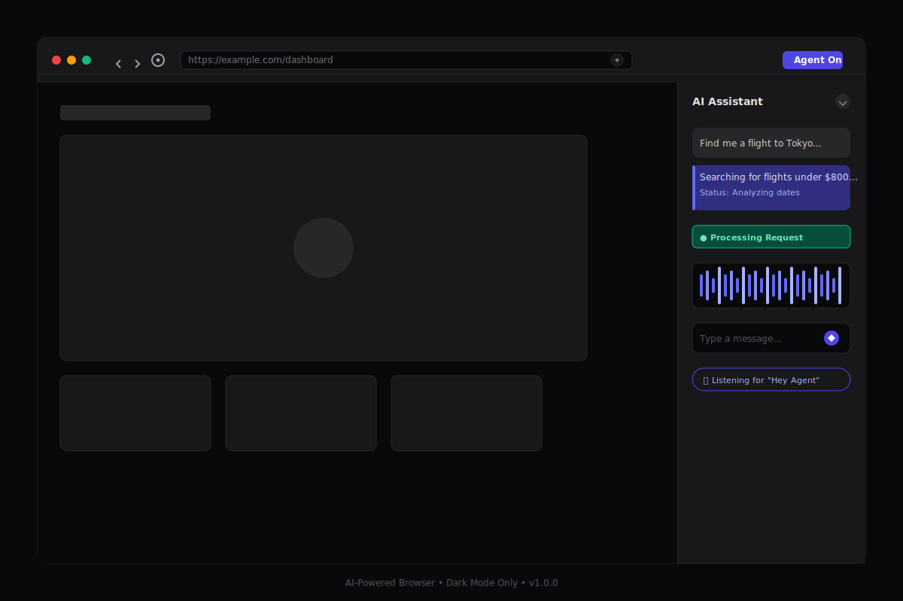

# AI Voice Browser

<div align="center">


**A production-ready, AI-powered web browser with native voice control**

[Features](#features) • [UI Preview](#ui-preview) • [Installation](#installation) • [Usage](#usage) • [Architecture](#architecture) • [Contributing](#contributing)

</div>

---

## 🎨 UI Preview

### Main Browser Interface

<div align="center">
  
  <p><em>Main interface featuring dark mode chrome, multi-tab support, AI assistant sidebar with chat history, and real-time voice waveform visualization.</em></p>
</div>

---

### Multi-Tab Browsing Experience

<div align="center">
  
  <p><em>Advanced tab management with AI-powered content analysis, floating recommendation cards, and intelligent search result highlighting.</em></p>
</div>

---

### Voice Control Active State

<div align="center">
  
  <p><em>Voice interaction mode with animated waveform, pulsing microphone indicator, and real-time command transcription when "Hey Agent" is detected.</em></p>
</div>

---

## 🌟 Features

### Dark Mode First
- **Sleek Dark Theme**: Built from the ground up with a dark mode only design
- **High Contrast**: Optimized for extended browsing sessions
- **Vibrant Accents**: Indigo and emerald highlights for active states

### Browser Interface
- **Multi-Tab Support**: Manage multiple tabs with dark-themed thumbnails
- **Navigation Controls**: Back, forward, refresh, and home buttons
- **Address Bar**: Smart URL input with search capabilities
- **Loading States**: Visual feedback during page loads

### AI Assistant Sidebar
- **Chat Interface**: Conversational AI powered by GPT-4o-mini
- **Task Status**: Real-time updates on AI actions (searching, clicking, typing)
- **Message History**: Persistent chat history with timestamps
- **Collapsible Panel**: Toggle sidebar visibility

### Voice Control
- **Wake Word Detection**: "Hey Agent" activation (Porcupine integration ready)
- **Speech-to-Text**: Web Speech API with Whisper.cpp fallback option
- **Text-to-Speech**: Web Speech API with ElevenLabs fallback option
- **Voice Commands**: Navigate, search, click, and type using voice

### Security
- **API Key Management**: Secure backend proxy for OpenAI and ElevenLabs
- **Environment Variables**: No hardcoded credentials
- **CORS Protection**: Configured for localhost development

---

## 📦 Installation

### Prerequisites

- Node.js 18+ 
- npm or yarn
- Git

### Clone the Repository

```bash
git clone https://github.com/yourusername/ai-voice-browser.git
cd ai-voice-browser
```

### Install Dependencies

```bash
npm install
```

### Configure Environment

```bash
cp .env.example .env
```

Edit `.env` and add your API keys:

```env
OPENAI_API_KEY=sk-your-openai-api-key
ELEVENLABS_API_KEY=your-elevenlabs-api-key  # Optional
```

---

## 🚀 Usage

### Development Mode

Run the React frontend and Electron app:

```bash
npm run dev
```

Start the backend server (optional, for AI features):

```bash
npm run backend
```

### Build for Production

```bash
npm run build
npm run build:electron
```

### Available Scripts

| Command | Description |
|---------|-------------|
| `npm run dev` | Start development mode (frontend + Electron) |
| `npm run dev:react` | Start React dev server only |
| `npm run dev:electron` | Start Electron after React is ready |
| `npm run build` | Build React frontend |
| `npm run build:electron` | Package Electron app |
| `npm run backend` | Start backend API server |
| `npm run lint` | Run ESLint |

---

## 🏗️ Architecture

### Tech Stack

```
┌─────────────────────────────────────────────┐
│                 Electron                    │
│  ┌─────────────────────────────────────┐    │
│  │           React Frontend            │    │
│  │  ┌──────────┐  ┌────────────────┐   │    │
│  │  │ Zustand  │  │  Tailwind CSS  │   │    │
│  │  │  Store   │  │   Shadcn/UI    │   │    │
│  │  └──────────┘  └────────────────┘   │    │
│  │  ┌──────────┐  ┌────────────────┐   │    │
│  │  │   Voice  │  │     Agent      │   │    │
│  │  │  Control │  │    Sidebar     │   │    │
│  │  └──────────┘  └────────────────┘   │    │
│  └─────────────────────────────────────┘    │
│                  Puppeteer                   │
└─────────────────────────────────────────────┘
              ↓
┌─────────────────────────────────────────────┐
│          Node.js/Express Backend            │
│  ┌──────────┐  ┌────────────────┐           │
│  │ OpenAI   │  │   ElevenLabs   │           │
│  │  Proxy   │  │     Proxy      │           │
│  └──────────┘  └────────────────┘           │
└─────────────────────────────────────────────┘
```

### Project Structure

```
ai-voice-browser/
├── electron/               # Electron main process
│   ├── main.js            # Main entry point
│   └── preload.js         # Preload script
├── src/                   # React source code
│   ├── components/        # UI Components
│   │   ├── ui/           # Base UI components
│   │   ├── browser/      # Browser chrome & viewport
│   │   ├── agent/        # AI assistant components
│   │   └── voice/        # Voice control
│   ├── hooks/            # Custom React hooks
│   ├── store/            # Zustand state management
│   ├── lib/              # Utilities
│   ├── types/            # TypeScript types
│   └── styles/           # Global styles
├── backend/              # Express API server
│   └── server.js         # API endpoints
├── public/               # Static assets
└── package.json          # Dependencies & scripts
```

---

## 🎨 Design System

### Color Palette

| Role | Color | Value |
|------|-------|-------|
| Background | Deep Gray | `#09090b` |
| Card | Zinc | `#18181b` |
| Primary | Indigo | `#6366f1` |
| Accent | Emerald | `#10b981` |
| Border | Zinc | `#27272a` |

### Typography

- **Font Family**: Inter, system-ui
- **Base Size**: 14px
- **Scale**: 1.2 (major third)

---

## 🔧 Configuration

### Tailwind Config

The project uses a custom Tailwind configuration optimized for dark mode:

```js
// tailwind.config.js
{
  darkMode: 'class',
  theme: {
    extend: {
      colors: {
        background: '#09090b',
        primary: '#6366f1',
        accent: '#10b981',
      }
    }
  }
}
```

### TypeScript Paths

```json
{
  "compilerOptions": {
    "paths": {
      "@/*": ["./src/*"],
      "@components/*": ["./src/components/*"]
    }
  }
}
```

---

## 🤝 Contributing

1. Fork the repository
2. Create a feature branch (`git checkout -b feature/amazing-feature`)
3. Commit your changes (`git commit -m 'Add amazing feature'`)
4. Push to the branch (`git push origin feature/amazing-feature`)
5. Open a Pull Request

### Development Guidelines

- Follow existing code style
- Write meaningful commit messages
- Add tests for new features
- Update documentation as needed

---

## 📄 License

This project is licensed under the MIT License - see the [LICENSE](LICENSE) file for details.

---

## 🙏 Acknowledgments

- [Electron](https://www.electronjs.org/) - Cross-platform desktop apps
- [React](https://react.dev/) - UI library
- [Zustand](https://zustand-demo.pmnd.rs/) - State management
- [Tailwind CSS](https://tailwindcss.com/) - Utility-first CSS
- [Shadcn/UI](https://ui.shadcn.com/) - UI components
- [OpenAI](https://openai.com/) - AI capabilities
- [Lucide Icons](https://lucide.dev/) - Beautiful icons

---

<div align="center">

**Built with ❤️ for the open source community**

[Report Bug](https://github.com/yourusername/ai-voice-browser/issues) · [Request Feature](https://github.com/yourusername/ai-voice-browser/issues)

</div>
